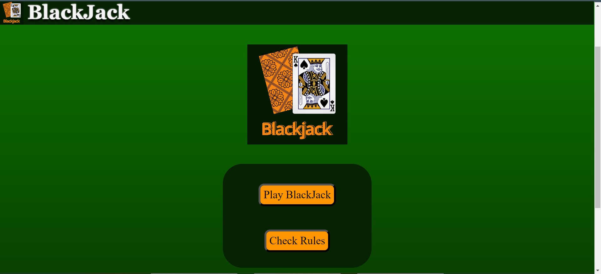

# BlackJack Project

## Overview

I developed the BlackJack project as a learning step to understand HTML DOM and JavaScript. The project focuses on implementing the classic card game of Blackjack.

## Screenshots

### In-game shots
- Homepage

- Gameplay

- Victory

## Features

- Implementing the core game mechanics of Blackjack.
- Utilizing HTML DOM for dynamic updates on the user interface.
- Showcasing JavaScript skills in game logic implementation.

## How to Run

1. Clone the repository.
2. Open the `index.html` file in a web browser.

## Technologies Used

- HTML
- CSS
- JavaScript

## Learning Objectives

- Gain proficiency in HTML DOM manipulation.
- Enhance JavaScript programming skills.
- Understand the development of interactive web applications.

## Future Improvements

- Add more features to enhance the gameplay.
- Improve the user interface for a better user experience.
- Refactor and optimize the code for better maintainability.

#### Special thanks To https://bicyclecards.com/

Feel free to explore the code in the [repository](https://github.com/FlashGrey3000/BlackJack-game/) and provide feedback or suggestions.